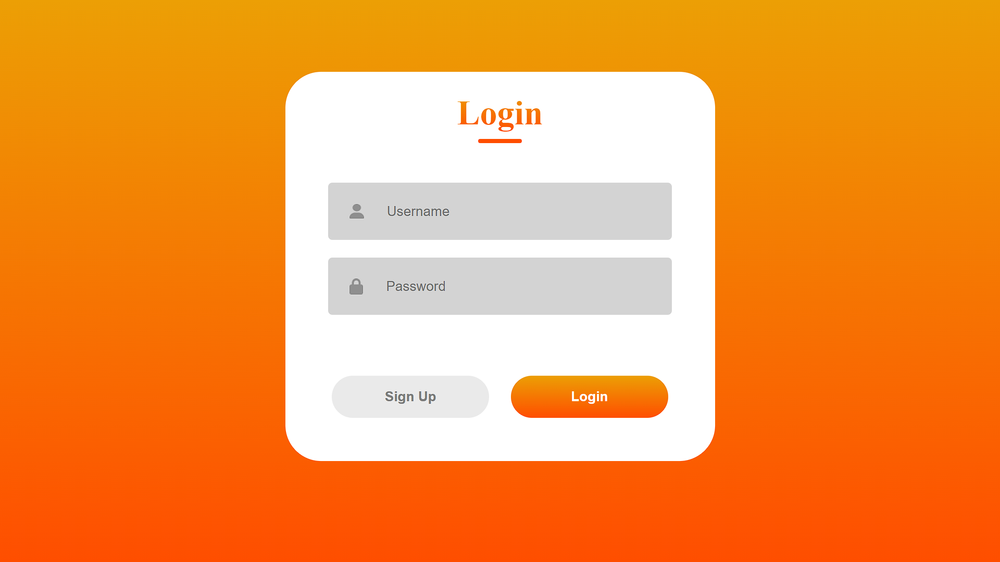
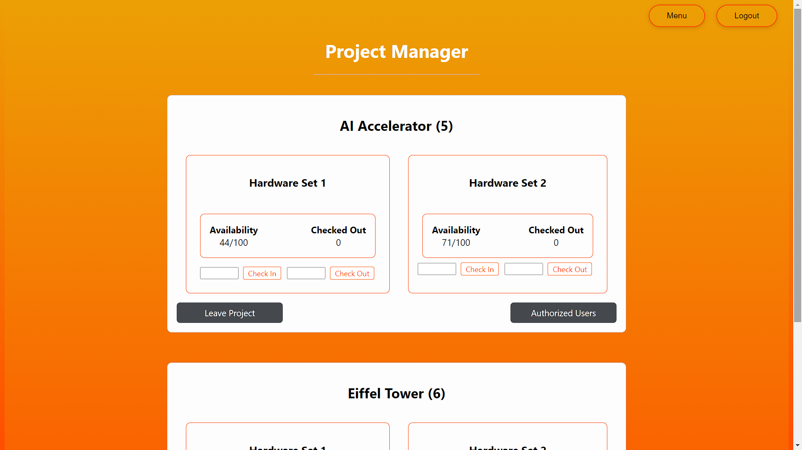

# H-Suite

 

A Proof of Concept (PoC) web application for a Hardware-as-a-Service (HaaS) system, inspired by the University of Utah POWDER program. The web application will enable users to create and manage secure user accounts, projects, and hardware resources while ensuring scalability and security.

# Getting Started

To get the project set up, follow these steps:

1. Clone this repository to your local machine: ```git clone https://github.com/Bushvacka/H-Suite.git```
2. Move into the repository directory: ```cd H-Suite```
3. Create a python environment: ```python -m venv .venv```
4. Activate the environment: ```.\.venv\Scripts\activate```
5. Install the requirements: ```pip install -r .\requirements.txt```
6. Move into the frontend directory: ```cd .\frontend\```
7. Install required dependencies: ```npm install```

# How to Run

1. Move into the backend directory: ```cd .\backend```
2. Start the flask application: ```py .\server.py```
3. Open a second terminal and move to frontend: ```cd .\frontend```
4. Start the frontend: ```npm start```

## Authors

- Jasper Tan
- Haakon Mongstad
- Jibran Cutlerywala
- Yuvraj Khullar
- Luca Macesanu
- Troy Dutton

# Useful Links
https://docs.google.com/document/d/1rREMYh2eRJrQb0zMIihBB1D_p-PS3HYOJI4QeCMYmmk/edit
